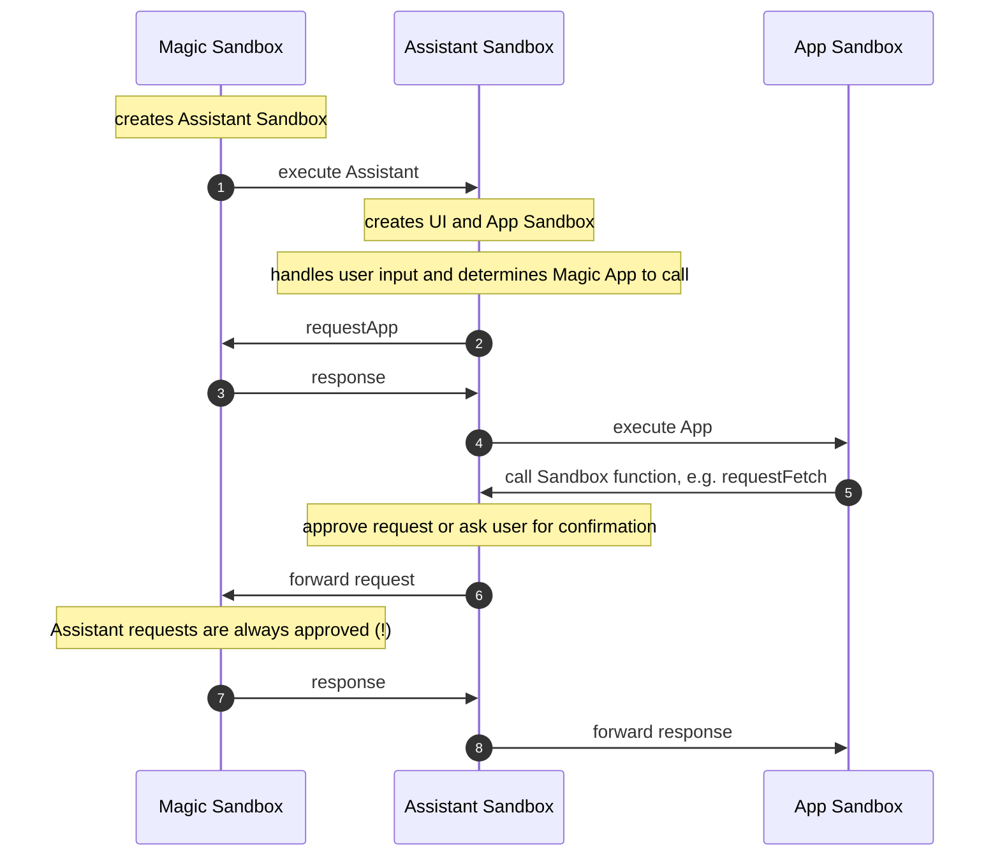

todo spellcheck
todo how to style code? so that the keys don't get lost in all the text
todo capitalize things consistently
periods or not?
check references to Function that should be App

# Magic Sandbox Documentation

This technical documentation is aimed at developers interested in writing code that runs on Magic Sandbox. For non-technical user support, please see the [About](todo) page. This documentation assumes you have already read through the About page and are familiar with Magic Sandbox at a high level.

This documentation is arranged in five main sections:

1. [Magic Apps](todo): we'll learn how to create Magic Apps.
2. [Magic Functions](todo): we'll cover Magic Functions, which are the backend equivalent to the frontend Magic Apps.
3. [Sandbox](todo): next we'll learn about the Sandbox, the environment in which Magic Apps run.
4. [Assistants](todo): then we'll dive into the responsibilities of an Assistant and how you can implement your own.
5. [Advanced Topics](todo): finally, we'll cover a few more advanced topics.

# Magic Apps

Magic Apps create the frontend interfaces you see in Magic Sandbox. Behind the scenes, they're simply JSON objects with a number of mostly optional keys. Only `name`, `version`, and one of `script`, `html`, or `style` are required. Let's walk through them:

### script (string)

String of JavaScript code which is executed in the user's browser inside the Sandbox. The user's input is saved in the global `input` variable in the Sandbox, so `script` has access to it.

### html (string)

String of HTML code which is appended to document.body in the Sandbox.

### style (string)

String of CSS code which is added as a `<style>` tag in the Sandbox.

## Shared Keys between Magic Apps and Magic Functions

All of the remaining Magic App JSON keys are shared with Magic Functions, so we'll cover them together here:

### name (**required**) (string)

Magic App names must begin with a capital letter to distinguish them from Magic Functions, which must begin with a lowercase letter. Names can include alphanumeric characters and underscores and be at most 64 characters.

### version (**required**) (string)

App or Function version. Follow [semantic versioning conventions](https://semver.org/).

### type (string)

Used to indicate that your App or Function has certain behavior. We expect to add more types over time, so please provide [feedback](todo).

App types:

- `assistant`: an [Assistant](todo). See [magicsandbox.Assistant](todo).

Function types:

- `findApp`: a Function that takes user input and returns the name of an appropriate App. See [magicsandbox.findApp](todo). todo max cost, return array, exclude deprecated, assistants

### description (string)

App or Function description. This is used to discover your App or Function, so while not required, you should fill this out.

### documentation (string)

Documentation of how to interact with your App or Function.

### minCost (number) (default 0.001)

Minimum cost in dollars required to call your App or Function. Must be at least $0.001.

### finalCost (number)

The final cost charged to call your App or Function. Apps and Functions have different behavior when it comes to `finalCost`:

For Apps, `finalCost` is the cost charged to the user and defaults to `minCost` if not provided. So why use `finalCost`? Imagine your App has a minCost of $0.01 but immediately upon loading makes an expensive requestFunction call that costs $0.10. The user may not have the budget to make the requestFunction call, leading to a poor user experience. Instead, you could set `minCost` to $0.11 and `finalCost` to $0.01, still charging the user $0.01 to call your App but ensuring they have the budget to make the required requestFunction call.

For Functions, `finalCost` is not actually accepted as a key in the Magic App JSON, but instead can be included in an object returned from your Function's endpoint. This enables Functions to charge different costs depending on the arguments to the Function. See [Variable Costs](#variable-costs) for details.

### private (boolean) (default false)

Set to true to make your App or Function private. Note: this just means your App or Function won't be published publicly [todo link to more info](todo). Anyone who knows your App or Function name can still call it, which enables sharing with others without publishing publicly. To keep your App or Function truly private, give it a hard to guess name and keep it a secret by treating the name like a password.

### deprecated (boolean) (default false)

Set to true to prevent your App or Function from being called, perhaps for an old version you no longer support.

## Making Your App Magical

Those are all the keys in a Magic App - pretty simple! At its core, a Magic App is just typical HTML/CSS/JavaScript along with some metadata. What makes a Magic App magical is how it exposes information to the Assistant by creating three global variables:

- `app.context`: () => string, a function that returns a string giving the Assistant context about your App. You can think of this like documentation, but it might not be just a hardcoded string - you may want to update it dynamically based on the current state of your App.
- `app.api`: { [key: string]: any }, an object that exposes your App's API to the Assistant.
- `app.render`: () => void, a function that rerenders your App.

Let's look at a simple example:

```javascript
import React from "react";
import { createRoot } from "react-dom/client";

function context() {
  return `API:
  - text: string, the text to display`;
}

const api = {
  text: "Hello, world!",
};

function App() {
  return <div>{api.text}</div>;
}

const root = createRoot(document.getElementById("root"));

function render() {
  root.render(<App />);
}

render(); //initial render

export { context, api, render }; //magicsandbox.Dev handles assigning these to the global app object for you during the build process
```

Now here's what happens if a user submits '!magic make it say "Goodbye!"':

1. The Assistant will call app.context() to get the context string.
2. Using AI, the Assistant will read the context and generate the script `app.api.text = 'Goodbye!'; app.render();`.
3. The Assistant executes the script in the Sandbox, updating the App to display 'Goodbye!' as requested.

### Best Practices

todo details on how to provide context
todo details on how to expose api
todo add example
todo explain magicsandbox.Dev/esbuild/globalName

if render errors, Assistant resets app.api and calls render

```javascript
try {
  const prevApi = app.api;
  app.api.text = "Goodbye!";
  app.render();
} catch (error) {
  //notify user
  app.api = prevApi;
  try {
    app.render();
  } catch (error) {
    //notify user
  }
}
```

## Publishing Magic Apps and Functions

You can publish Magic Apps and Functions in two ways:

### Using an app like magicsandbox.Dev

magicsandbox.Dev is a convenient way to create and publish Magic Apps. It handles the build process for you, provides a live preview so you can test your App as you develop, and includes a button for easy publishing. See [the magicsandbox.Dev documentation](todo) for more details.

magicsandbox.PublishFunction is a simple interface for publishing Magic Functions.

Behind the scenes, magicsandbox.Dev and magicsandbox.PublishFunction call [requestPublish](todo), which we'll cover later.

### Making a POST request to magicsandbox.ai/publish

Your request should:

- Include URL parameters:
  - `kind`: 'app' or 'function'
  - `name`: App or Function name
  - `version`: App or Function version
- Include the headers `Content-Type: application/json` and `Authorization: Bearer <apiKey>`, where `<apiKey>` is your API key, which you can generate [here](https://magicsandbox.ai/api-key)
- Include the App or Function JSON object as the body of the request

Here's an example:

```javascript
fetch(
  `https://magicsandbox.ai/publish?kind=app&name=${appObj.name}&version=${appObj.version}`,
  {
    method: "POST",
    headers: {
      "Content-Type": "application/json",
      Authorization: `Bearer ${apiKey}`,
    },
    body: JSON.stringify(appObj),
  },
);
```

# Magic Functions

Magic Functions are the backend equivalent to Magic Apps. Magic Apps can call Magics Functions, and Magic Functions can call other Magic Functions.

Like Magic Apps, Magic Functions are also just JSON objects. See [shared keys](#shared-keys-between-magic-apps-and-magic-functions) above for the keys you can include.

Magic Sandbox currently only supports Magic Functions that you host on your own server using `endpoint`. `name`, `version`, and `endpoint` are required keys for Magic Functions.

### endpoint (**required**) (string)

HTTPS URL that Magic Sandbox will call to execute your backend code:

- The request is a POST that will timeout after 60 seconds
- Includes headers:
  - `Content-Type: application/json`
  - If you have an API key, `Authorization: Bearer <hashedKey>`, where `<hashedKey>` is the SHA-256 hash of your API key encoded as a hexadecimal string. You can generate an API key [here](https://magicsandbox.ai/api-key). See below code snippets that generate `hashedKey`.
- Includes the body `{ fn, args, options, userInfo? }`, where:
  - `fn`, `args`, `options` were the arguments to [requestFunction](todo)
  - `userInfo` (object): See below type. Included if `options.includeUserInfo` is true

```typescript
type UserInfo = {
  id: string;
  //todo geography?
};
```

```javascript
const hashedKey = crypto.createHash("sha256").update(apiKey).digest("hex");
```

```python
hashed_key = hashlib.sha256(api_key.encode()).hexdigest()
```

### decode (string) (default 'json')

Specifies how to decode the response from your Function's endpoint. Supported values:

- `'json'` (default): Parse the response as JSON. If parsing fails, the response will be returned as a string.
- `'string'`: Decode the response as a UTF-8 string
- `'bytes'`: Return the raw bytes as an ArrayBuffer

### stream (boolean) (default false)

Whether your Function supports streaming.

Special care should be taken when streaming with decode set to 'json'. See [Streaming JSON](#streaming-json) for details.

### subscribeToUpdates (boolean) (default false)

Whether you want your endpoint to receive updates when users publish or update Apps or Functions. See [Subscribing to Updates](#subscribing-to-updates) for details.

# Sandbox

As described on the [About](todo) page, to protect the user, Magic Apps execute in a Sandbox. The Sandbox is implemented as an iframe with a sandbox attribute. The Sandbox environment is restrictive but provides a number of global functions that enable you to bypass these restrictions. Each of these Sandbox functions has a name that begins with `request`, reflecting the fact that they may fail if not approved. The Assistant is responsible for approving Sandbox requests, either automatically if determined to be safe or by asking for user confirmation.

The Sandbox has the following high level restrictions and associated Sandbox functions:

- Limited network access. APIs like `fetch` don't work, and you can't use traditional links.
  - Use `requestApp` and `requestFunction` to call other Magic Apps and Magic Functions
  - Use `requestFetch` to fetch data from another website
  - Use `requestOpenUrl` to open a link in a new tab
  - Use `requestPublish` to publish a Magic Function
  - Note: currently there are limited ways that your App can access the network without using a Sandbox function. You should not rely on these, as they may be blocked at any time without warning.
- No direct access to web storage APIs.
  - Use `requestPutData`, `requestDeleteData`, `requestGetData`, `requestGetAllData`, and `requestGetAllKeysData` to store and retrieve data
- Permissions to use certain browser features like creating popups or accessing the camera may be blocked. We expect the allowed permissions to evolve over time. Please share any [feedback](todo) you have.

todo error handling - RequestSandboxError

## Calling Magic Apps and Functions

### requestApp(app, options?) => Promise<{style?: string, html?: string, script?: string, metadata: {app: string, finalCost: number}}>

Retrieves a Magic App's `style`, `html`, and `script`.

**Arguments:**

- `app` (**required**) (string): Magic App to call, either in the form author.name@version or just author.name, in which case the latest version is used.
- `options` (object):
  - `maxCost` (number) (default 0.001): Maximum cost you're willing to pay for the App call, which should be at least the App's minCost. Magic Apps can't charge variable costs, so you'll be charged the App's minCost.

**Returns:** a Promise that resolves to an App:

```typescript
type App = {
  style?: string;
  html?: string;
  script?: string;
  metadata: { app: string; finalCost: number };
};
```

### requestFunction(fn, args, options?) => Promise

Executes a Magic Function and returns the result.

**Arguments:**

- `fn` (**required**) (string): Magic Function to call, either in the form author.name@version or just author.name, in which case the latest version is used.
- `args` (**required**) (any): Arguments to pass to the called Function.
- `options` (object):
  - `maxCost` (number) (default 0.001): Maximum cost you're willing to pay for the Function call, which should be at least the Function's minCost. Refer to [variable costs](todo) for more details.
  - `stream` (boolean) (default false): Whether to stream the result.
  - `includeUserInfo` (boolean) (default false): Whether to include [user info](todo).

**Returns:** a Promise that includes the result from the Function and metadata about the Function call. The type depends on the `stream` option.

- `stream: false`: `Promise<{result: any, metadata: Metadata}>`. This is the default behavior. Resolves to an object with keys `result` and `metadata`.
- `stream: true`: `Promise<AsyncIterable<{result: any} | {metadata: Metadata}>>`. Resolves to an AsyncIterable, which can be consumed using a `for await...of` loop. Each streamed chunk is an object with either a `result` key or a `metadata` key, not both. `result` is populated on all chunks except the final chunk, while `metadata` is populated on only the final chunk. See [magicsandbox.Chat](todo) for an example.

Metadata:

- fn: string, resolved with version
- finalCost: number
- errorCode: number
- errorMessage: string

From your endpoint, you can call requestFunction by:

- Making a POST request to magicsandbox.ai/endpoint-request-function
- Authenticating using an [API key](todo)
- Including in the body:
  - `fn`, `args`, `options`: the arguments to requestFunction

## Storing and Retrieving Data

Magic Sandbox provides Sandbox functions for storing and retrieving key/value pairs. Each Magic App has its own isolated storage, ensuring that keys used by one App don't interfere with keys used by another.

All of the data Sandbox functions require an `app` argument, which specifies which App to use for storage, in the form of 'author.app'. Most Apps should just use their own name as the `app` argument. Put and delete requests that specify an `app` that has not been called with requestApp will cause an error.

Each Magic App can store up to 10 MB of data. There is no concept of App version used for storage, so author1.app1@1.0.0 and author1.app1@1.0.1 store data in the same location. If you need separate storage for App versions, you'll have to use the key/value pairs yourself to accomplish that.

### requestPutData (app: string, key: string, val: any, options?) => true

Store a key/value pair using app's storage. val will be serialized using JSON.stringify.

**Options:**

- `evictionPolicy` (string): Controls behavior if the put would cause the app to exceed its storage limit. Supported values:
  - `undefined` (default): Does not evict any key/value pairs and returns a 'Database size limit exceeded' error.
  - `'fifo'`: Evict the oldest key/value pairs as needed to make room for the new key/value pair.

### requestDeleteData (app: string, key: string) => true

Delete a key/value pair using app's storage.

### requestGetData (app: string, key: string) => val: any

Retrieve a key/value pair using app's storage.

### requestGetAllData (app: string) => { [key: string]: any }

Retrieve all key/value pairs using app's storage.

### requestGetAllKeysData (app: string) => string[]

Retrieve all keys using app's storage.

## Other Sandbox Functions

### requestFetch (resource, options?) => Promise<SerializedResponse>

Make a fetch request.

**Arguments:** see the [fetch docs](https://developer.mozilla.org/en-US/docs/Web/API/Fetch_API).

Only the following fetch `options` are supported: `body`, `headers`, `integrity`, `method`, `priority`, `redirect`.

Additionally, `options` accepts an additional `responseType` option used to parse the response body:

- `auto` (default): Parse as json or string according to the Content-Type header. If the Content-Type header is not present, returns an arrayBuffer.
- `json`: Parse the response as JSON
- `string`: Decode the response as a UTF-8 string
- `bytes`: Return the raw bytes as an ArrayBuffer

**Returns:** a Promise that resolves to a SerializedResponse, since the Response object itself cannot be serialized and passed into the Sandbox.

```typescript
type SerializedResponse = {
  body: any; // parsed according to responseType
  status: number;
  headers: { [headerName: string]: string };
};
```

### requestOpenUrl (url) => Promise<true>

Open a URL in a new tab. Traditional links don't work in the Sandbox, so use `requestOpenUrl` instead.

Don't do this:

```html
<a href="https://example.com">Click me</a>
```

Do this instead:

```html
<a onclick="requestOpenUrl('https://example.com')">Click me</a>
```

**Arguments**:

- `url` (**required**) (string): URL to open

**Returns:** a Promise that resolves to true

### requestPublish (magicObj) => Promise<true>

Publish a Magic Function or Magic App.

todo

### requestDownload ({ filename: string, url: string, content: BlobPart }) => Promise<true>

Download a file.

**Arguments:** an object with the following keys:

- `filename` (**required**) (string): filename to use for the downloaded file
- `url` (string): URL to download
- `content` (BlobPart): content of the file. Can be a string, or see [Blob](https://developer.mozilla.org/en-US/docs/Web/API/Blob/Blob) for accepted types.

Either `url` or `content` must be provided.

**Returns:** a Promise that resolves to true

todo why is args an object

### requestUrlParams() => Promise<{ [key: string]: string }>

Retrieve parameters from the URL used to load the page. For example, if the page was loaded using `https://magicsandbox.ai/?input=hello`, then requestUrlParams() would return `{ input: 'hello' }`.

### requestSandbox (request: string, args: any) => Promise<any>

A convenience function to call other Sandbox functions.

**Arguments:** an object with the following keys:

- `request` (**required**) (string): the Sandbox function to call. 'app' calls requestApp, 'function' calls requestFunction, 'putData' calls requestPutData, etc.
- `args` (any): the arguments to pass to the Sandbox function

**Returns:** the result from the Sandbox function

# Assistants

**Note:** you don't need to know all these details to create a Magic App or Function (though you may find it helpful context). This section is aimed at those who want to develop their own Assistant. See [magicsandbox.Assistant](todo) for an example Assistant implementation.

Assistants are simply Magic Apps that are executed in a Sandbox immediately when the user loads the page. Like any other Magic App, the Sandbox restrictions apply, but Sandbox functions like requestApp are available. The key difference though is that Magic Sandbox always approve Sandbox requests made by the Assistant. This gives Assistants enormous power, which is why it's so critical that users trust their Assistant.

There are no hard restrictions on what exactly an Assistant does, but Assistants should typically do at least two things:

1. Create a UI to accept user input and handle user input by executing other Magic Apps. To execute Magic Apps safely, the Assistant needs to create its own child Sandbox.
2. Handle requests from Magic Apps executing in the child Sandbox.

The rest of this section assumes you're following this basic pattern. We'll use the following terminology:

- Magic Sandbox: the top level webpage that the user loads in their browser. The parent of the Assistant Sandbox.
- Assistant Sandbox: the Sandbox iframe that the Assistant runs in. The parent of the App Sandbox.
- App Sandbox: the Sandbox iframe that Magic Functions run in.

A typical series of interactions between the three looks like this:



## Handling User Input and Executing Magic Functions

Magic Sandbox does not provide any UI beyond the navigation bar at the top of the page, so it's up to the Assistant to create a UI that can accept user input, parse, and handle user input. Features like `!magic` and other bangs are implemented by magicsandbox.Assistant, not by Magic Sandbox.

Let's say your Assistant has handled some user input and determined a Magic App to call. The Assistant must create a child App Sandbox to execute the Magic App safely. The [Sandbox](todo) component provides some helpers to make this easier, or you can create an iframe yourself with src set to 'frame.html'.

The 'frame.html' file loads [frame.js](todo), which sets up a listener in the App Sandbox. The listener enables the Assistant to control the App Sandbox by listening for an object with specific keys and taking action based on those keys:

- `script`: App Sandbox will execute the script
- `style`: App Sandbox will append the style to the document's head
- `html`: App Sandbox will append the html to the document's body
- `args`: App Sandbox will save the object to the global `args` variable

todo url params

## Handling Sandbox Requests

When the App Sandbox calls a Sandbox function like requestFetch, it uses postMessage to send a message to its parent, the Assistant Sandbox, that looks like this:

```javascript
{
  id: number,
  msg: {
    request: 'fetch',
    data: { resource, options },
  },
}
```

The App Sandbox then listens for a response from the Assistant Sandbox including the same id. So an Assistant needs to:

1. Listen for messages from the App Sandbox
2. Approve the request, deny it, or ask the user for confirmation
3. Forward the request to its parent, Magic Sandbox
4. Forward the response from Magic Sandbox to the App Sandbox

```javascript
async function handleRequest(event) {
  // 1. listen for messages
  if (event.source !== appSandbox.contentWindow) return;
  if (!(event.data.id && event.data.msg?.request)) return;
  const { id, msg } = event.data;
  const { request, data } = msg;
  // 2. approve/deny/ask for confirmation. a proper implementation should batch requests when asking for user confirmation
  const confirmed = await handleConfirm(request, data);
  let response;
  if (!confirmed) {
    response = { error: "User denied the request" };
  } else {
    delete data.options?.backup; //don't allow apps to access backup storage, see below for details
    // 3. forward the request
    response = await requestSandbox(request, data);
  }
  // 4. forward the response
  event.source.postMessage({ id, response }, "*");
}

window.addEventListener("message", handleRequest);
```

todo update with proper error handling

### Guidelines for Approving Sandbox Requests

Assistants should consider the following risks when approving Sandbox requests:

#### Financial Risk

**Relevant Sandbox functions: requestApp, requestFunction**

Assistants should track the cost incurred by requestApp and requestFunction over time and prompt users for approval when exceeding reasonable thresholds.

todo budget

#### Publishing Risk

**Relevant Sandbox functions: requestPublish**

Publishing Magic Apps and Functions is potentially dangerous. A malicious App could publish a broken or malicious new version of an App or Function, or deprecate an App or Function against the author's will. Assistants should always ask for user approval when requestPublish is called.

#### Privacy Risk

**Relevant Sandbox functions: requestGetData, requestGetAllData, requestGetAllKeysData**

Assistants should ask for user approval before allowing cross-author reads.

Currently, there are ways for Apps to access the network without using a Sandbox function, so Assistants should assume that Apps can exfiltrate any data they can access. Assistants should therefore block reads (e.g. requestGetData) as needed rather than attempting to block exfiltration (e.g. requestFetch).

#### Data Loss Risk

**Relevant Sandbox functions: requestPutData, requestDeleteData**

Assistants should ask for user approval before allowing cross-author writes.

Like any other Magic App, Assistants can use the data Sandbox functions to store data. Assistants however can supply a `backup` option to the data Sandbox functions to access a separate storage location with a much higher limit of 1 GB. This backup storage is isolated from the Assistant's main storage and is not backed up in the cloud or synced to other devices. Assistants can backup data to protect against data loss risk:

```javascript
//take backup of all of author.App's data
requestPutData(
  "magicsandbox.Assistant", //app
  "author.App", //key
  await requestGetAllData("author.App"), //val
  { evictionPolicy: "fifo", backup: true }, //options
);

//retrieve backup
requestGetData("magicsandbox.Assistant", "author.App", { backup: true });
```

Assistants should not allow Apps access to this backup storage.

#### Download Risk

**Relevant Sandbox functions: requestDownload**

Assistants should prompt the user for approval when the App Sandbox attempts to download a file.

#### Rate Limiting

**Relevant Sandbox functions: requestApp, requestFunction, requestFetch, requestOpenUrl, requestPublish**

Assistants should provide rate limiting to network requests to prevent abuse.

trust? track denials in addition to thumbs down

todo handling url params

todo includeuserinfo

# Advanced Topics

## Limits

- 10 MB of storage per Magic Function
- 1 GB of storage per Assistant
- 10 seconds runtime per request

etc

## Streaming JSON

When streaming over a network, the client may not receive chunks that correspond to your writes; your writes may be combined or split across multiple chunks. This will cause issues if streaming with `decode` set to 'json':

```javascript
//on your server
res.write(JSON.stringify({ msg: "hello" }));
res.end(JSON.stringify({ msg: " world!" }));

//in Sandbox
for await (const chunk of result) {
  console.log(chunk);
}
//could print:
//'{"msg":"hello"}{"msg":" world!"}'
```

In this example, the server makes two writes, but they were combined into a single chunk over the network, so the chunks are no longer valid JSON.

The Sandbox can reconstruct your writes and properly parse JSON if you prefix each chunk with its length. You can do this by:

1. Including an `x-length-prefix` header in your response
2. Prefixing each chunk of your response with its 4-byte length (big-endian uint32)

If `decode` is set to 'json' and you don't send the `x-length-prefix` header, Magic Sandbox won't stream the result into the Sandbox.

Rather than implement this yourself, you can use the [JavaScript](todo) or [Python](todo) helpers and do something like:

```javascript
import { createLengthPrefixTransform } from "@magicsandbox.ai/streaming";
import { pipeline } from "stream/promises";
// ...
const source = somehowGetReadable(); //your readable stream
res.setHeader("x-length-prefix", "true"); //your response writable stream
await pipeline(source, createLengthPrefixTransform(), res);
```

```python
from magicsandbox import length_prefix_transform
from fastapi.responses import StreamingResponse
# ...
source = somehow_get_async_iterable() #your async iterable
return StreamingResponse(length_prefix_transform(source), headers={'x-length-prefix': 'true'})
```

Consult your specific server framework's documentation for details.

## Command Object

Usually Function results are intended for the user, but there are scenarios where you want to instruct the Magic Sandbox server to do something:

- [Charge the caller a variable cost](todo)

You do this using a command object, which is an object with two keys: `result` and `__command`. `result` will be sent to the user, while `__command` is interpreted by the server.

```typescript
type CommandObject = {
  result: any; //will be sent to the user
  __command: {
    //interpreted by the server
    finalCost;
  };
};
```

You have to signal to the server that your response is a command object, which you can do by including an `x-command-object` header in your response. The server will attempt to parse the entire response as a command object.

The command object cannot exceed 100KB. If you have a large result you want to send to the user, consider streaming it instead. You can stream a result that includes a command object by:

1. Including an `x-length-prefix` header in your response
2. Prefixing each chunk of your response with its 4-byte length (big-endian uint32)
3. Except for the final chunk, which must be prefixed with the special 4-byte sequence [0xFF, 0xFF, 0xFF, 0xFF] (four 255 bytes). The server will attempt to parse the final chunk as a command object.

Rather than implement this yourself, you can use the [JavaScript](todo) or [Python](todo) helpers and do something like:

```javascript
import { createLengthPrefixTransform } from "@magicsandbox.ai/streaming";
import { pipeline } from "stream/promises";
// ...
const source = somehowGetReadable(); //your readable stream
res.setHeader("x-length-prefix", "true"); //your response writable stream
await pipeline(
  source,
  createLengthPrefixTransform({ finalObject: true }), //prefix final chunk with 0xFFFFFFFF
  res,
);
```

```python
from magicsandbox import length_prefix_transform
from fastapi.responses import StreamingResponse
# ...
source = somehow_get_async_iterable() #your async iterable
return StreamingResponse(
  length_prefix_transform(source, final_object=True), #prefix final chunk with 0xFFFFFFFF
  headers={'x-length-prefix': 'true'}
);
```

## Variable Costs

Magic Sandbox enables Functions to charge variable costs:

1. When a Function is published, it specifies a minCost, the minimum cost the publisher will accept.
2. When a Function is called, the caller specifies maxCost, the maximum cost they're willing to pay.
   - Magic Sandbox ensures that maxCost is greater than or equal to the Function's minCost.
3. When the Function executes, it can specify finalCost, the actual cost the user will be charged.
   - Magic Sandbox ensures finalCost is between $0.001 and maxCost.
   - If finalCost is not specified, it defaults to minCost.
   - requestApp does not support variable costs and always charges minCost.

Variable costs are implemented using a [Command Object](todo). Here's an example:

```javascript
function main(args, options) {
  const length = Math.min(args.input.length, options.maxCost / 0.001);
  return {
    result: args.input.slice(0, length).toUpperCase(),
    __command: {
      finalCost: length * 0.001,
    },
  };
}
```

## Public App and Function Metadata

todo add details on publishing full list to S3 periodically

todo `private` does not appear here

### Subscribing to Updates

If you set `subscribeToUpdates` to true, your endpoint will receive updates when users publish or update Apps or Functions. This enables you to create metaFunctions like [magicsandbox.findApp](todo), which takes user input and finds an App that best matches it.

- The request is a POST to `endpoint/update`, so if your endpoint is `https://example.com/my-function`, you'll receive updates at `https://example.com/my-function/update`.
- Includes headers:
  - `Content-Type: application/json`
  - `Authorization: Bearer <hashedKey>`, see [endpoint](todo).
- Includes a `MagicMetadata` body

```typescript
type MagicMetadata = {
  id: string; //author.name@version
  author: string;
  name: string;
  version: string;
  kind: "app" | "function";
  description: string;
  documentation: string;
  type: string;
  minCost: number;
  deprecated: boolean;
  decode: "json" | "string" | "bytes";
  stream: boolean;
};
```

## Questions or Feedback

For additional questions or feedback, please create an issue on [GitHub](todo) or reach out to help@magicsandbox.com or feedback@magicsandbox.com. We'd love to hear from you!
