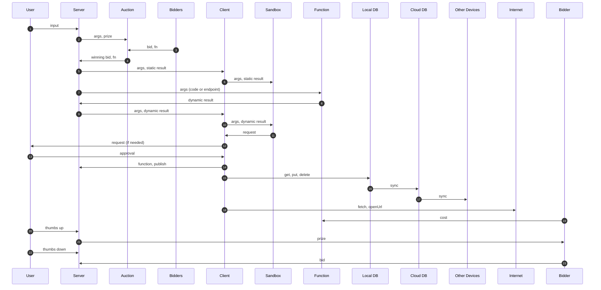
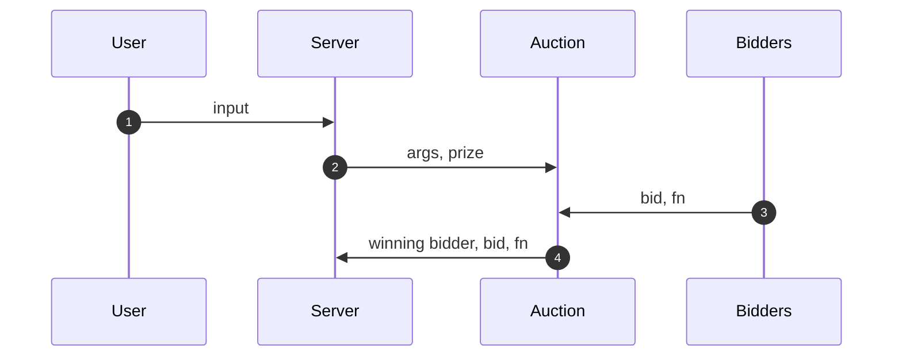
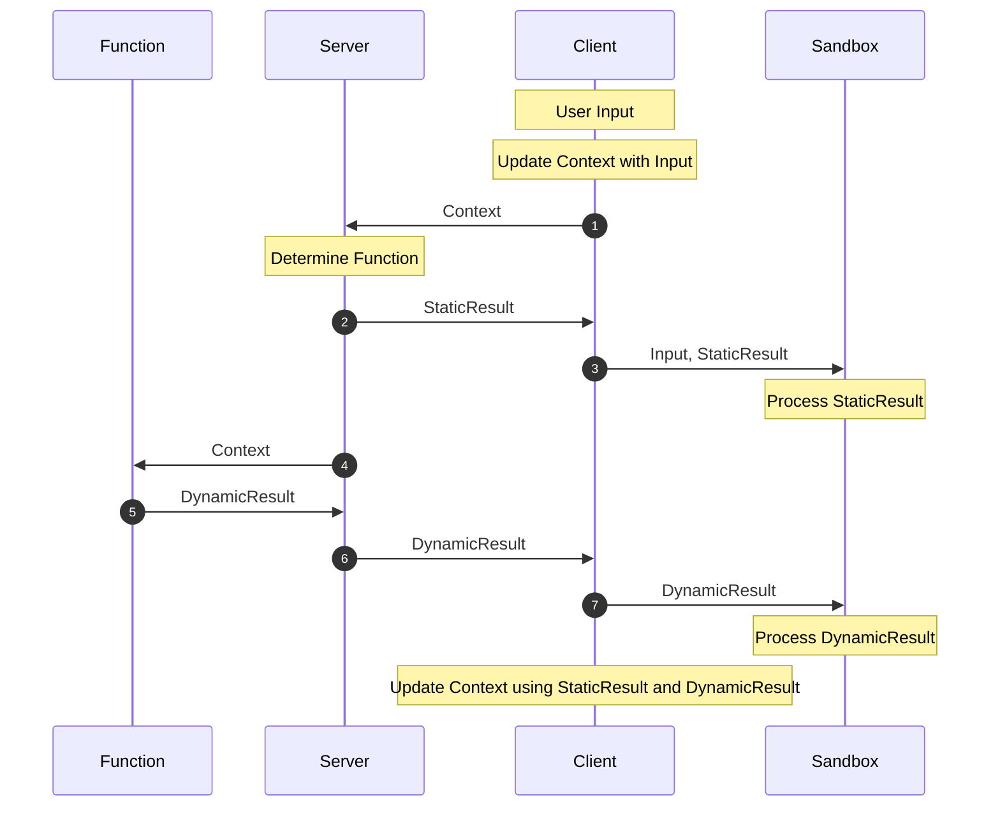
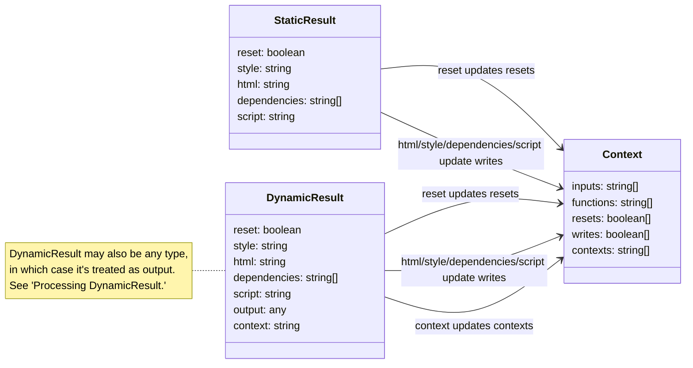
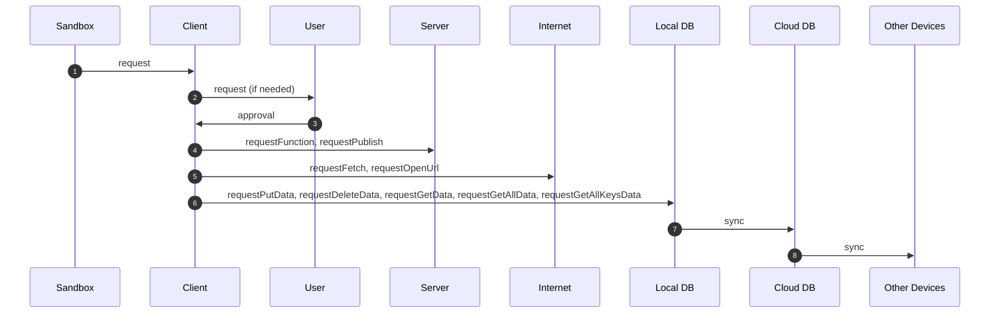
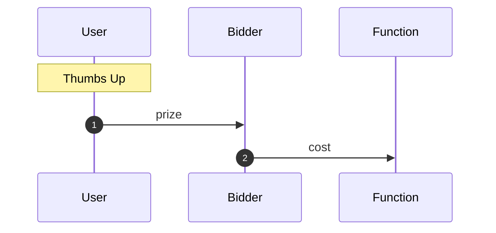
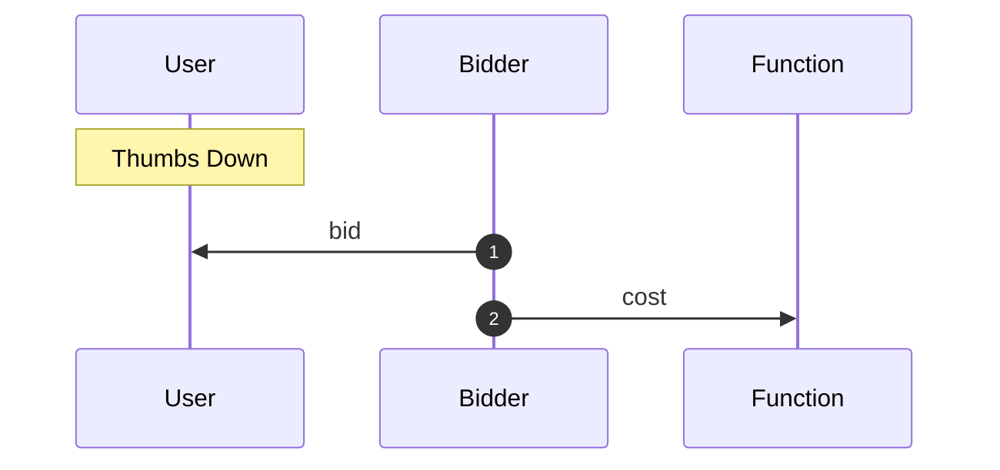
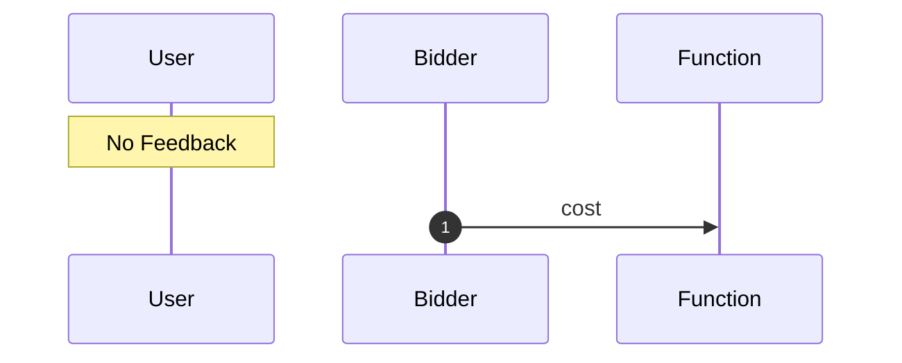
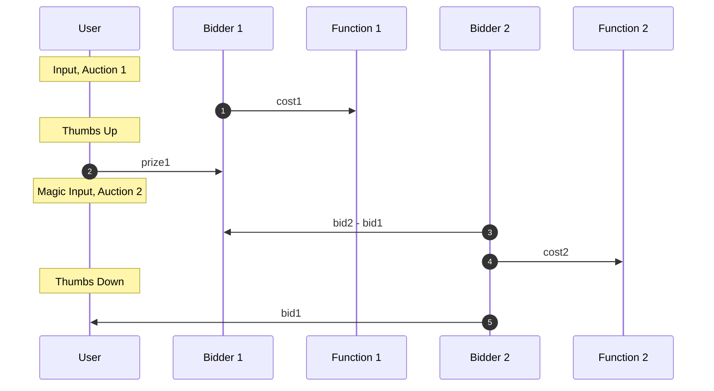

# Full



# Auction



# Function

This one needs some work



Processing StaticResult:
input saved to window.input, can be overwritten so save it if needed

Processing DynamicResult:
reset/style/html/dependencies/script processed same way as StaticResult
output saved to window.output, can be overwritten so save it if needed
if none of these keys are present, if streamDynamic is true, or if decodeDynamic is false, the entire DynamicResult is saved to window.output
for example, a dynamicResult:

```javascript
{
  someKey: "someValue",
  anotherKey: "anotherValue",
}
```

is treated the same as:

```javascript
{
  output: {
    someKey: "someValue",
    anotherKey: "anotherValue",
  },
}
```



resets/writes if either static or dynamic

# Sandbox



# Payments

## Thumbs Up



## Thumbs Down



## No Feedback



## Magic Bang


